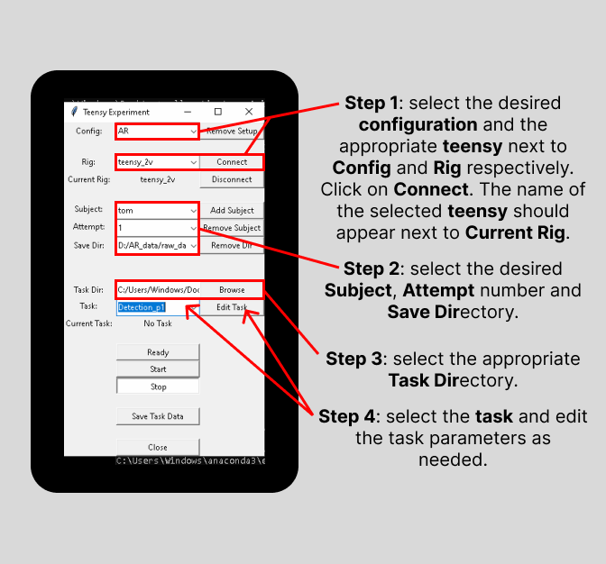
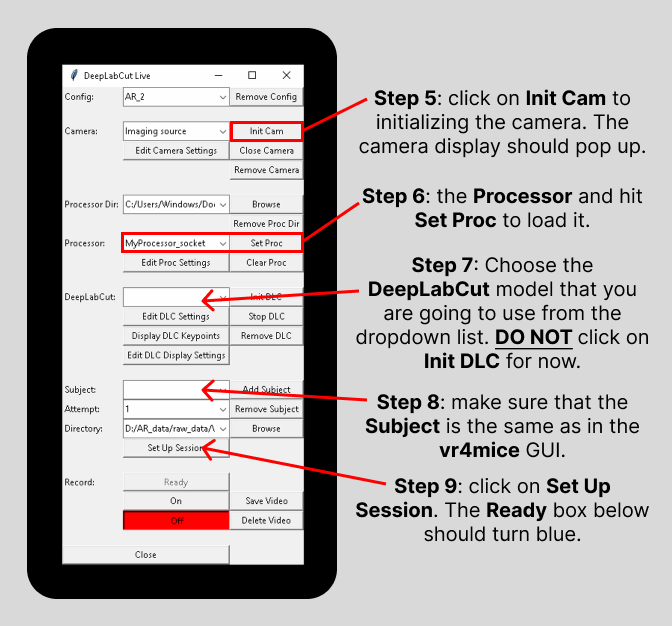
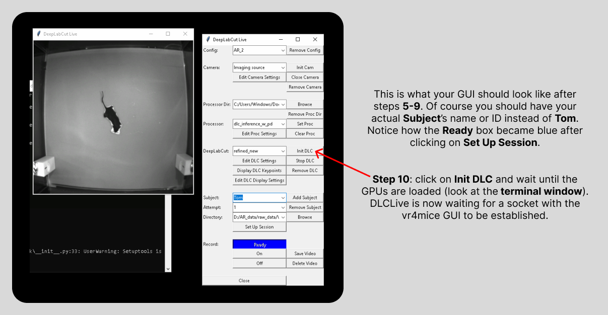
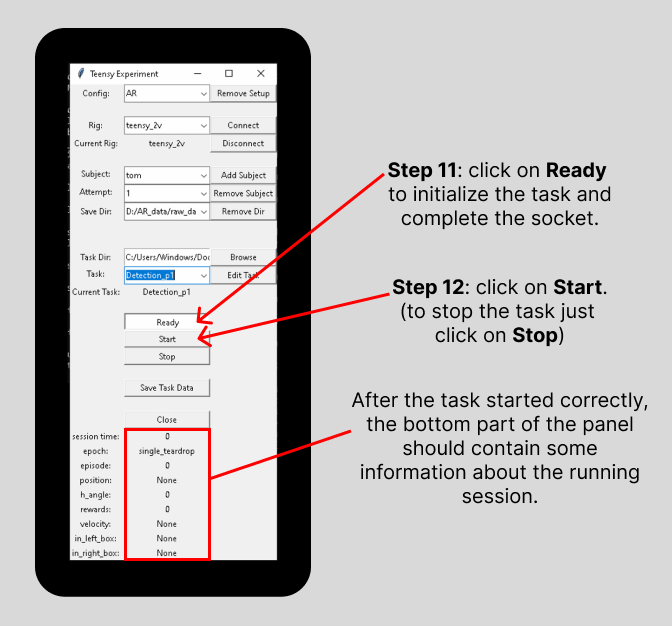
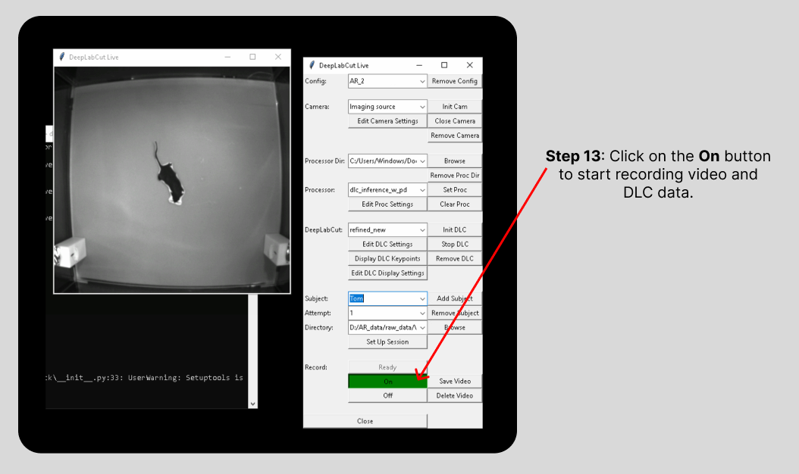
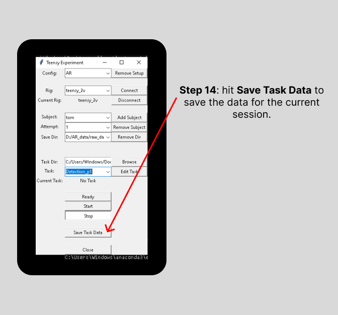
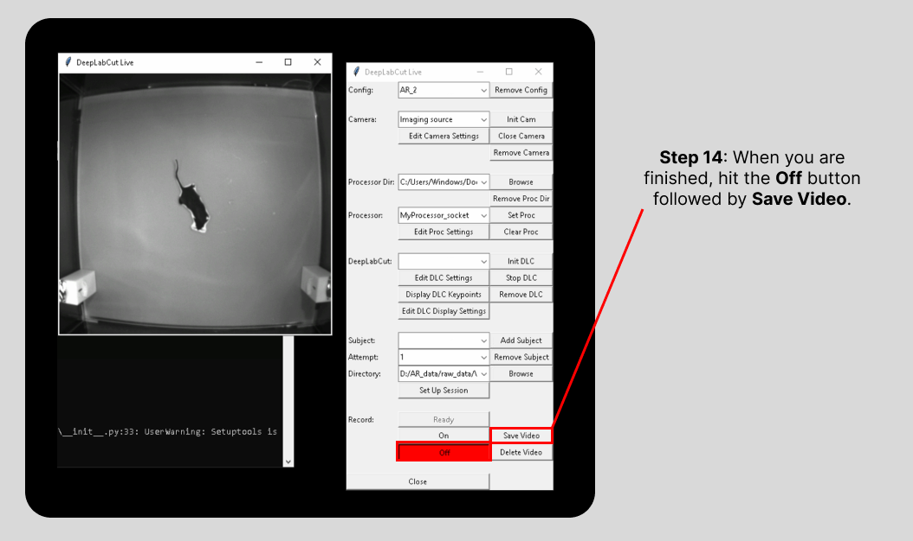

# How to run a session

## Open the 2 GUIs
### VR4mice
In a terminal window, activate your conda environment where you installed the **vr4mice** package source code like this:
```
conda activate env_name
```
Then, to start a session, you can run:
```
vr4mice
```
Finally, the GUI that controls the experiment logic should appear!
Alternatively, you can add these commands to a .bat script so that all you need to do it click on an icon on your [Desktop](./create_desktop_icon.md).

### DeepLabCut-live
In a second terminal window, activate your conda environment where you installed the **dlclivegui** package source code just like you did above for the **vr4mice** environment.
Then, to start the GUI, you can run:
```
dlclivegui
```
This should open up the DLCLive GUI on your screen!

>_**Note:**_ close the program using the GUI's "**Stop**"/"**Close**" buttons, and **NOT** via "crtl-C"/"crtl-Z"
## Set up a session in the VR4mice GUI (aka Teensy Experiment)

<!-- <div align="center">
  
</div> -->

```{image} ../../docs/images/run_session_steps_1-4.png
:alt: Steps 1 to 4
:width: 55%
:align: center
```

1) Select the desired configuration, the appropriate **Rig** and hit "**Connect**".
(_the name of the selected **Rig** should appear next to **Current Rig**_)
2) Select the **Subject**'s ID or name, the **Attempt** number and define the **Save Dir**ectory.
3) Select the wanted **Task Dir**ectory.
4) Define the **Task** and edit its parameters as needed.

## Open the DeepLabCut-live GUI

<!-- <div align="center">
  
</div> -->

```{image} ../../docs/images/run_session_steps_5-9.png
:alt: Steps 5 to 9
:width: 55%
:align: center
```

5) Initialize the camera by clicking the "**Init Cam**" button.
(_a window should pop up with an a live video stream from the camera_)

6) Select the **Processor** file and hit "**Set Proc**" to load it.
7) Choose the **DeepLabCut** model that you are going to use from the dropdown list.
(_**DO NOT** hit **Init DLC** for now_)
8) Select the **Subject**'s name (or ID) and make sure it matches the one on the **vr4mice** GUI.
9) Hit "**Set Up Session**".
(_the **Ready** box below should turn blue_)

<!-- <div align="center">
  
</div> -->

```{image} ../../docs/images/run_session_step_10.png
:alt: Step 10
:width: 95%
:align: center
```

10) Hit "**Init DLC**" and wait until the GPUs are loaded (look at the **terminal window**). DLCLive is now waiting for a socket with **vr4mice** GUI to be established.

## On the VR4mice window

<!-- <div align="center">
  
</div> -->

```{image} ../../docs/images/run_session_steps_11-12.png
:alt: Steps 11 and 12
:width: 55%
:align: center
```

11) Click on "**Ready**" to initialize the task and complete the socket.
12) Click on "**Start**".
(_if you need to manually stop the task, hit "**Stop**". Otherwise, the task will stop automatically_)
	> After the task started correctly, the bottom part of the panel should contain some information about the running session.

## On the DeepLabCut-live window

<!-- <div align="center">
  
</div> -->

```{image} ../../docs/images/run_session_step_13.png
:alt: Step 13
:width: 95%
:align: center
```

13) Hit "**On**" to start recording video and DLC data.

## Saving data

### On the VR4mice window:

<!-- <div align="center">
  
</div> -->

```{image} ../../docs/images/run_session_step_14a.png
:alt: Step 14a
:width: 55%
:align: center
```

14) To save the data, hit "**Save Task Data**".
> _Data will be saved to: `<your save directory>/<subject>_YYYY-MM-DD_<attempt>.pickle`_

### On the DeepLabCut-live window:

<!-- <div align="center">
  
</div> -->

```{image} ../../docs/images/run_session_step_14b.png
:alt: Step 14b
:width: 95%
:align: center
```

14) Hit the record "**Off**" button followed by "**Save Video**".
	> 3 different data types will be saved in the directory specified in the DLCLive-GUI:
	>	- `.avi` = the raw video
	>	- `_TS.npy` = the time steps for each of the recorded frames
	>	- `.h5` = the recorded DLC key-points
	>	- `PROC` = the processed dlc key-points which get sent to the unity game
  
To run another session, repeat the above steps. Data from the previous session is still loaded (and can be saved again with a different file name by changing the subject or attempt) until a new task is initialized (i.e. until you click "**Ready**").
